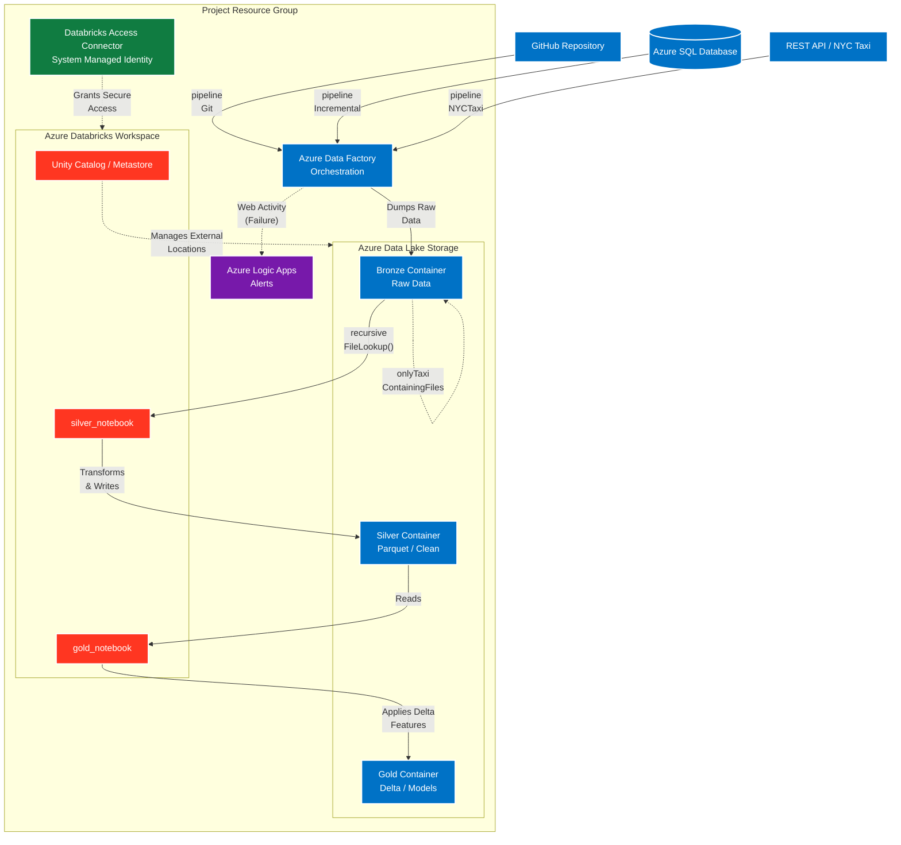

# 🚀 Azure Enterprise Data Platform: Multi-Source Medallion Architecture

> A robust, end-to-end data engineering solution implementing the Medallion Architecture (Bronze, Silver, Gold). This project orchestrates complex data ingestion from multiple disparate sources (REST APIs, GitHub, Azure SQL) using Azure Data Factory. Transformation and dimensional modeling are executed via Azure Databricks (PySpark) managed securely by Unity Catalog, with automated CI/CD and Logic App alerting.

---

## 🏗️ Architecture Overview

The pipeline leverages a master orchestrator (ADF) to ingest data from three different environments into a unified Bronze layer. From there, Azure Databricks securely mounts the Data Lake using an Access Connector and processes the data through the Silver (cleansed) and Gold (modeled) layers, utilizing advanced Delta Lake capabilities.

## 🚀 Deployed Resources (Resource Group)

This project relies on 8 distinct resources deployed within a single Azure Resource Group:

1. **Azure Data Factory (ADF):** The primary orchestration engine for multi-source ingestion.
2. **Azure Databricks Workspace:** The compute engine for scalable PySpark data transformations.
3. **Databricks Access Connector:** Provides a Managed Identity for secure, keyless Data Lake access.
4. **Azure SQL Server:** The logical server hosting the relational database.
5. **Azure SQL Database:** Acts as one of our primary source systems for structured data ingestion.
6. **Azure Data Lake Storage (ADLS Gen2):** The centralized storage divided into Medallion zones.
7. **Azure Logic Apps:** Handles automated email notifications and pipeline failure alerts.
8. **Unity Catalog (Logical Resource):** Governs data access, external locations, and managed tables.

---

## 🏅 Medallion Architecture Implementation

### 1. Bronze Layer (Multi-Source Ingestion via ADF)
To populate the raw Bronze container, I engineered **5 distinct ADF Pipelines** to handle three different data sources (GitHub, SQL, REST API):

* **`pipelineGit`:** Utilizes a Copy Activity to migrate files directly from a GitHub repository into the Bronze container.
  
  

* **`pipelineNYCTaxi`:** A dynamic pipeline fetching data from a REST API. It uses a `ForEach` Activity, `If Condition`, and `Copy` Activity to iterate through API endpoints and dump the NYC Taxi data into ADLS in Parquet format.
  

* **`pipelineIncremental`:** A highly complex, parameterized pipeline handling incremental loads and backfills from the **Azure SQL Database**.
  * *Incremental Logic:* Reads a CDC JSON file containing a watermark (e.g., `1900-01-01`). It uses `Lookup`, `SetVariable`, and `Copy` activities to fetch records where the timestamp exceeds the watermark. A `Delete` activity and subsequent Copy updates the JSON file with the new `MAX(updated_at)`.
  * *Backfill Logic:* Evaluates a `from_date` parameter using an `If Condition`. If empty, the pipeline runs the incremental logic. If a date is provided, it triggers a backdate refresh, loading historical data without breaking the CDC watermark.
  

* **`onlyTaxiContainingFiles`:** A file-filtering pipeline inside the Data Lake. It uses a `GetMetadata` Activity to read the container, a `ForEach` Activity to iterate through files, and an `If Condition` to migrate *only* the files starting with the string `"taxi"` using a Copy Activity.
  

* **`Prod pipeline`:** The master orchestrator. It uses `Execute Pipeline` activities to trigger the ingestion pipelines, and features a `Web Activity` to trigger the **Azure Logic App** REST API for alerts.
  

### 2. Silver Layer (Transformation via PySpark)
* **`silver_notebook`:** Deployed in Azure Databricks to process the Bronze data. 
* To seamlessly handle multiple nested Parquet files dumped by ADF, the notebook utilizes PySpark's **`recursiveFileLookup()`** option when reading the `trip_data` directories.
* Applies necessary schema enforcement, data type casting, and data cleaning before writing the structured data out to the Silver container.

### 3. Gold Layer (Advanced Delta Lake & Dimensional Modeling)
* **`gold_notebook`:** Reads the cleansed Silver data to construct dimensional models (Facts and Dimensions) for business reporting.
* **Catalog & Schema Creation:** Programmatically builds the Unity Catalog, Schemas, and the final Delta Tables.
* **Advanced Delta Features:** This layer heavily utilizes the deep features of the Delta Lake format, including:
  * **Time Travel & Versioning:** Querying historical states of the tables.
  * **Cloning:** Utilizing both **Deep Clones** (full copies) and **Shallow Clones** (metadata-only) for safe testing environments.
  * **Optimization:** Using the `OPTIMIZE` command with Z-Ordering to compact small files and speed up reads.
  * **Deletion Vectors:** Implemented to speed up `DELETE` and `UPDATE` operations by marking rows as deleted rather than rewriting entire files.
  * **Tombstoning:** Managed physical file cleanup (Vacuuming) to handle deleted file states.

---

## 🔐 Security & Unity Catalog Setup

This project implements modern Azure security standards, completely avoiding hardcoded storage keys:
1. Created a **Unity Catalog Metastore** linked to the Databricks workspace.
2. Provided the Data Lake container path to serve as the root for UC managed resources.
3. Bound the **Databricks Access Connector ID** during the Unity Catalog creation.
4. Created a **Storage Credential** inside Databricks using the Access Connector.
5. Built an **External Location** on top of the Storage Credential, granting Databricks PySpark clusters secure read/write access to the Bronze, Silver, and Gold ADLS containers purely via System Managed Identity.
